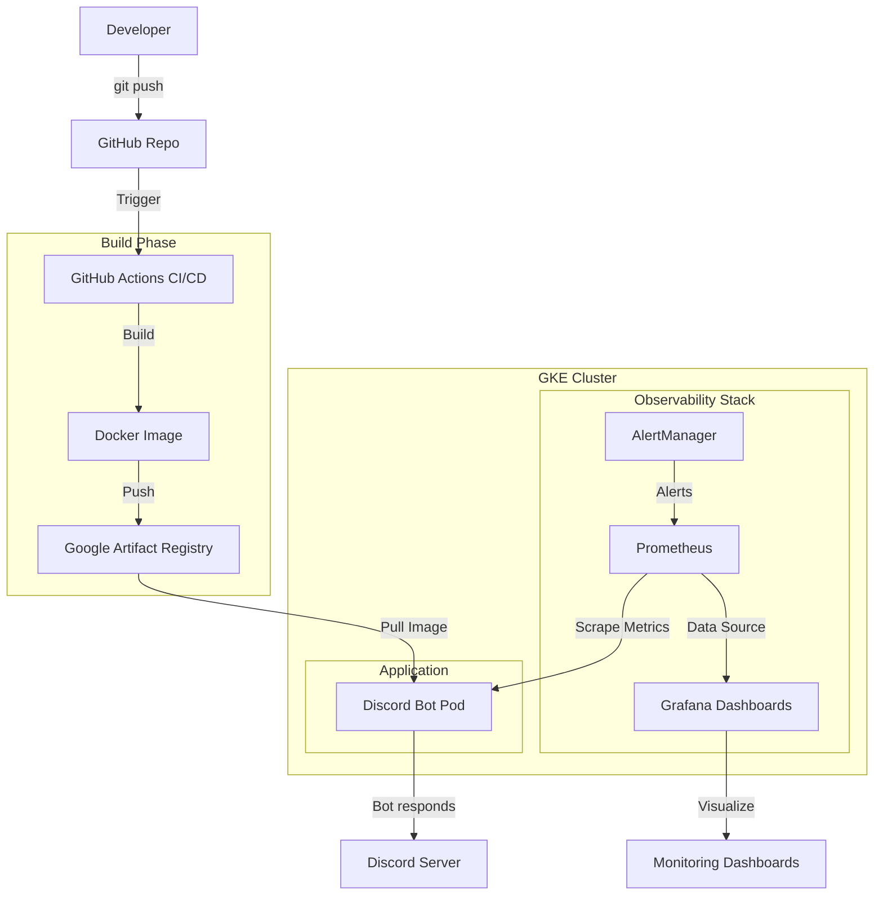
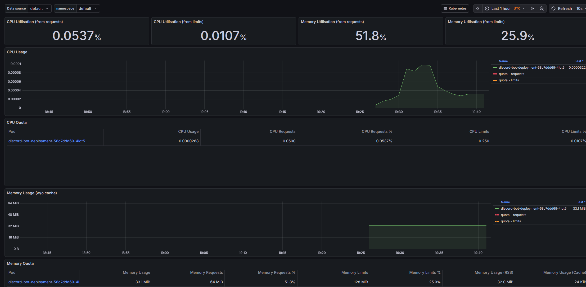

# 🤖 Discord Kubernetes Bot

<div align="center">


A Discord bot running on Google Kubernetes Engine (GKE) with automated CI/CD pipeline, infrastructure as code, full observability stack, and real-time pod monitoring capabilities.

[Features](#-features) • [Architecture](#-architecture) • [Getting Started](#-getting-started) • [Commands](#-commands) • [Observability](#-observability) • [Deployment](#-deployment)

</div>

---

## 📋 Overview

This project demonstrates modern DevOps practices by deploying a Discord bot to a production-grade Kubernetes cluster on Google Cloud Platform. It showcases automated CI/CD pipelines, infrastructure provisioning with Terraform, containerized application deployment, and a complete observability stack with Prometheus and Grafana.

## ✨ Features

- 🎯 **Discord Integration** - Simple, focused bot with clean architecture
- 🔭 **Full Observability** - Prometheus metrics collection + Grafana dashboards via kube-prometheus-stack
- 🚀 **CI/CD Pipeline** - Automated build and deployment with GitHub Actions
- ☸️ **Kubernetes Native** - Runs on GKE with proper resource limits and requests
- 🏗️ **Infrastructure as Code** - Complete infrastructure managed with Terraform
- 🐳 **Containerized** - Docker-based deployment for consistency
- 🔒 **Secrets Management** - Secure handling of tokens and credentials
- 📈 **Modular Architecture** - Clean code structure following SOLID principles
- 📊 **Latency Tracking** - Command execution and API latency monitoring

## 🏛️ Architecture



### Tech Stack

| Component | Technology |
|-----------|-----------|
| **Language** | Python 3.12 |
| **Bot Framework** | discord.py 2.3.2 |
| **Container** | Docker |
| **Orchestration** | Kubernetes (GKE) |
| **Cloud Provider** | Google Cloud Platform |
| **IaC** | Terraform |
| **CI/CD** | GitHub Actions |
| **Registry** | Google Artifact Registry |
| **Monitoring** | Prometheus + Grafana (kube-prometheus-stack) |
| **Metrics** | psutil, discord.py latency API |

## 🎮 Commands

| Command | Description | Output |
|---------|-------------|--------|
| `!ping` | Check bot latency and status | Pong with current latency in ms |

**Architecture Focus:** This bot prioritizes clean code architecture over features. The single `!ping` command demonstrates:
- Modular command structure
- Singleton pattern for metrics
- Proper separation of concerns
- Professional logging
- Error handling

## 🔭 Observability

### Prometheus + Grafana Stack

Implemented full observability using **kube-prometheus-stack** Helm chart:

```bash
# Install kube-prometheus-stack
helm repo add prometheus-community https://prometheus-community.github.io/helm-charts
helm repo update
helm install prometheus prometheus-community/kube-prometheus-stack \
  --namespace monitoring \
  --create-namespace
```

### 📊 Dashboard Example

Real-time monitoring of the bot's memory and CPU usage inside the cluster:



### What's Monitored

| Component | Metrics |
|-----------|---------|
| **Pod Resources** | CPU usage, Memory consumption, Network I/O |
| **Container Metrics** | Container restarts, resource limits/requests |
| **Node Metrics** | Node CPU, memory, disk usage |
| **Kubernetes** | Pod status, deployment health, replica count |

### Accessing Dashboards

```bash
# Port-forward Grafana
kubectl port-forward svc/prometheus-grafana 3000:80 -n monitoring

# Default credentials
# Username: admin
# Password: prom-operator (or check secret)
kubectl get secret prometheus-grafana -n monitoring -o jsonpath="{.data.admin-password}" | base64 -d
```

### Alerting

AlertManager is configured to detect anomalies:
- 🔴 High CPU usage (>80%)
- 🔴 High memory consumption (>90%)
- 🔴 Pod restarts
- 🔴 Container OOMKilled events

## 🚀 Getting Started

### Prerequisites

- Python 3.12+
- Docker
- kubectl
- Helm 3.x
- Terraform
- Google Cloud account
- Discord Bot Token

### Local Development

1. **Clone the repository**
   ```bash
   git clone https://github.com/Xellor-Dev/discord-k8s-bot.git
   cd discord-k8s-bot
   ```

2. **Set up environment variables**
   ```bash
   cd app
   cp .env.example .env
   # Add your DISCORD_TOKEN to .env
   ```

3. **Install dependencies**
   ```bash
   pip install -r requirements.txt
   ```

4. **Run the bot locally**
   ```bash
   python bot.py
   ```

### Docker Build

```bash
cd app
docker build -t discord-k8s-bot:latest .
docker run -e DISCORD_TOKEN=your_token discord-k8s-bot:latest
```

## 🌩️ Deployment

### Infrastructure Provisioning

The project includes Terraform configurations for automated GKE cluster provisioning.

```bash
cd terraform
terraform init
terraform plan
terraform apply
```

**What gets created:**
- GKE Autopilot cluster
- Google Artifact Registry repository
- IAM roles and service accounts
- Network configurations

### Kubernetes Deployment

1. **Configure kubectl**
   ```bash
   gcloud container clusters get-credentials <cluster-name> --region <region>
   ```

2. **Create Discord token secret**
   ```bash
   kubectl create secret generic discord-bot-secrets \
     --from-literal=DISCORD_TOKEN=your_discord_token_here
   ```

3. **Deploy the bot**
   ```bash
   kubectl apply -f k8s/deployment.yaml
   ```

4. **Deploy observability stack**
   ```bash
   helm repo add prometheus-community https://prometheus-community.github.io/helm-charts
   helm repo update
   helm install prometheus prometheus-community/kube-prometheus-stack \
     --namespace monitoring --create-namespace
   ```

5. **Verify deployment**
   ```bash
   kubectl get pods
   kubectl logs -f deployment/discord-bot-deployment
   ```

### CI/CD Pipeline

The GitHub Actions workflow automatically:
1. 🏗️ Builds Docker image on every push
2. 🏷️ Tags with commit SHA
3. 📤 Pushes to Google Artifact Registry
4. 🚀 Deploys to GKE cluster
5. ✅ Verifies deployment success

## 📁 Project Structure

```
discord-k8s-bot/
├── app/
│   ├── bot.py              # Main entry point (60 lines)
│   ├── config.py           # Configuration constants
│   ├── logger.py           # Logging setup
│   ├── commands/           # Command modules
│   │   ├── __init__.py
│   │   └── ping.py         # !ping command
│   ├── services/           # Business logic
│   │   ├── __init__.py
│   │   ├── metrics.py      # MetricsCollector singleton
│   │   └── k8s_info.py     # Kubernetes metadata
│   ├── Dockerfile          # Container configuration
│   ├── requirements.txt    # Python dependencies
│   └── .dockerignore       # Docker build exclusions
├── k8s/
│   └── deployment.yaml     # Kubernetes manifests
├── terraform/
│   ├── provider.tf         # GCP provider config
│   ├── main.tf             # VPC and networking
│   └── gke.tf              # GKE cluster definition
├── .github/
│   └── workflows/          # CI/CD pipelines
└── README.md               # This file
```

## 🏗️ Code Architecture

This project demonstrates **clean code principles** and **modular architecture**:

### Design Patterns
- **Singleton Pattern** - `MetricsCollector` for centralized state management
- **Dependency Injection** - Bot instance passed to commands
- **Separation of Concerns** - Commands, services, and configuration separated

### SOLID Principles
- **Single Responsibility** - Each module has one clear purpose
- **Open/Closed** - Easy to add new commands without modifying core
- **Dependency Inversion** - High-level modules don't depend on low-level details

### Key Features
- ✅ No global variables (replaced with Singleton)
- ✅ Professional logging (no `print()` statements)
- ✅ Centralized configuration
- ✅ Error handling with proper logging
- ✅ Clean, testable code structure

**Refactoring Results:**
- 74% reduction in main file size (231 → 60 lines)
- 100% elimination of global variables
- 6 focused modules vs 1 monolithic file

## 🛠️ Configuration

### Kubernetes Resources

The deployment is configured with:

| Resource | Value |
|----------|-------|
| **Replicas** | 1 (single instance) |
| **CPU Request** | 50m |
| **CPU Limit** | 250m |
| **Memory Request** | 64Mi |
| **Memory Limit** | 128Mi |
| **Restart Policy** | Always |
| **Image Pull Policy** | Always |

### Environment Variables

| Variable | Description | Source |
|----------|-------------|--------|
| `DISCORD_TOKEN` | Discord bot authentication token | Secret |
| `POD_NAMESPACE` | Kubernetes namespace | fieldRef |
| `NODE_NAME` | GKE node name | fieldRef |
| `POD_NAME` | Pod name | fieldRef |
| `CPU_LIMIT` | CPU limit for display | Static |
| `MEMORY_LIMIT` | Memory limit for display | Static |
| `CPU_REQUEST` | CPU request for display | Static |
| `MEMORY_REQUEST` | Memory request for display | Static |

## 📊 Monitoring

### kubectl Commands

```bash
# View logs
kubectl logs -f deployment/discord-bot-deployment

# Check resource usage
kubectl top pods

# Describe pod details
kubectl describe pod -l app=discord-bot

# Watch pod status
kubectl get pods -w
```

### Grafana Dashboards

```bash
# Access Grafana UI
kubectl port-forward svc/prometheus-grafana 3000:80 -n monitoring

# Access Prometheus UI
kubectl port-forward svc/prometheus-kube-prometheus-prometheus 9090:9090 -n monitoring
```

## 🤝 Contributing

Contributions are welcome! Feel free to:

1. Fork the project
2. Create a feature branch (`git checkout -b feature/AmazingFeature`)
3. Commit your changes (`git commit -m 'Add some AmazingFeature'`)
4. Push to the branch (`git push origin feature/AmazingFeature`)
5. Open a Pull Request

## 📝 License

This project is a personal learning project and is available as-is for educational purposes.

## 🙏 Acknowledgments

- [discord.py](https://github.com/Rapptz/discord.py) - Python Discord API wrapper
- [Kubernetes](https://kubernetes.io/) - Container orchestration
- [Google Cloud Platform](https://cloud.google.com/) - Cloud infrastructure
- [Terraform](https://www.terraform.io/) - Infrastructure as Code
- [kube-prometheus-stack](https://github.com/prometheus-community/helm-charts) - Observability stack
- [Grafana](https://grafana.com/) - Metrics visualization

---

<div align="center">

**[⬆ Back to Top](#-discord-kubernetes-bot)**

Made with ❤️ and ☸️ by [Xellor-Dev](https://github.com/Xellor-Dev)

</div>
