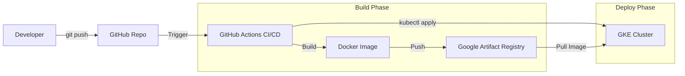

```mermaid
graph LR
    User[Developer] -->|git push| GitHub[GitHub Repo]
    GitHub -->|Trigger| Actions[GitHub Actions CI/CD]
    
    subgraph Build Phase
        Actions -->|Build| Docker[Docker Image]
        Docker -->|Push| GCR[Google Artifact Registry]
    end
    
    subgraph Deploy Phase
        Actions -->|kubectl apply| GKE[GKE Cluster]
        GCR -->|Pull Image| GKE
    end
```
