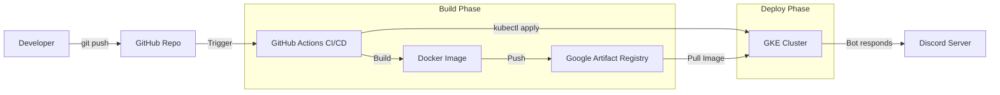

# 🤖 Discord Kubernetes Bot

<div align="center">


A Discord bot running on Google Kubernetes Engine (GKE) with automated CI/CD pipeline, infrastructure as code, and real-time pod monitoring capabilities.

[Features](#-features) • [Architecture](#-architecture) • [Getting Started](#-getting-started) • [Commands](#-commands) • [Deployment](#-deployment)

</div>

---

## 📋 Overview

This project demonstrates modern DevOps practices by deploying a Discord bot to a production-grade Kubernetes cluster on Google Cloud Platform.  It showcases automated CI/CD pipelines, infrastructure provisioning with Terraform, and containerized application deployment. 

## ✨ Features

- 🎯 **Discord Integration** - Interactive bot with custom commands
- 📊 **Real-time Monitoring** - View CPU, RAM, and pod statistics directly in Discord
- 🚀 **CI/CD Pipeline** - Automated build and deployment with GitHub Actions
- ☸️ **Kubernetes Native** - Runs on GKE with proper resource management
- 🏗️ **Infrastructure as Code** - Complete infrastructure managed with Terraform
- 🐳 **Containerized** - Docker-based deployment for consistency
- 🔒 **Secrets Management** - Secure handling of tokens and credentials

## 🏛️ Architecture



### Tech Stack

| Component | Technology |
|-----------|-----------|
| **Language** | Python 3.12 |
| **Bot Framework** | discord.py 2.3.2 |
| **Container** | Docker |
| **Orchestration** | Kubernetes (GKE) |
| **Cloud Provider** | Google Cloud Platform |
| **IaC** | Terraform |
| **CI/CD** | GitHub Actions |
| **Registry** | Google Artifact Registry |

## 🎮 Commands

| Command | Description | Example |
|---------|-------------|---------|
| `!ping` | Check if the bot is alive | `!ping` |
| `!info` | Display detailed pod statistics (CPU, RAM, uptime, system info) | `!info` |

### Example Output

The `!info` command displays a rich embed with:
- 🤖 Bot name and status
- ⏱️ Uptime since last deployment
- 🧠 Current CPU usage
- 💾 RAM consumption
- 🐧 Operating system details
- 🐍 Python version
- 📍 Pod hostname

## 🚀 Getting Started

### Prerequisites

- Python 3.12+
- Docker
- kubectl
- Terraform
- Google Cloud account
- Discord Bot Token

### Local Development

1. **Clone the repository**
   ```bash
   git clone https://github.com/Xellor-Dev/discord-k8s-bot.git
   cd discord-k8s-bot
   ```

2. **Set up environment variables**
   ```bash
   cd app
   cp .env.example .env
   # Add your DISCORD_TOKEN to .env
   ```

3. **Install dependencies**
   ```bash
   pip install -r requirements.txt
   ```

4. **Run the bot locally**
   ```bash
   python bot.py
   ```

### Docker Build

```bash
cd app
docker build -t discord-k8s-bot: latest .
docker run -e DISCORD_TOKEN=your_token discord-k8s-bot: latest
```

## 🌩️ Deployment

### Infrastructure Provisioning

The project includes Terraform configurations for automated GKE cluster provisioning. 

```bash
cd terraform
terraform init
terraform plan
terraform apply
```

**What gets created:**
- GKE Autopilot cluster
- Google Artifact Registry repository
- IAM roles and service accounts
- Network configurations

### Kubernetes Deployment

1. **Configure kubectl**
   ```bash
   gcloud container clusters get-credentials <cluster-name> --region <region>
   ```

2. **Create Discord token secret**
   ```bash
   kubectl create secret generic discord-token \
     --from-literal=DISCORD_TOKEN=your_discord_token_here
   ```

3. **Deploy the bot**
   ```bash
   kubectl apply -f k8s/deployment.yaml
   ```

4. **Verify deployment**
   ```bash
   kubectl get pods
   kubectl logs -f deployment/discord-bot
   ```

### CI/CD Pipeline

The GitHub Actions workflow automatically:
1. 🏗️ Builds Docker image on every push
2. 🏷️ Tags with commit SHA
3. 📤 Pushes to Google Artifact Registry
4. 🚀 Deploys to GKE cluster
5. ✅ Verifies deployment success

## 📁 Project Structure

```
discord-k8s-bot/
├── app/
│   ├── bot.py              # Main bot application
│   ├── Dockerfile          # Container configuration
│   ├── requirements.txt    # Python dependencies
│   └── .dockerignore       # Docker build exclusions
├── k8s/
│   └── deployment.yaml     # Kubernetes manifests
├── terraform/
│   ├── provider.tf         # GCP provider config
│   ├── main.tf            # Main infrastructure
│   └── gke.tf             # GKE cluster definition
└── . github/
    └── workflows/          # CI/CD pipelines
```

## 🛠️ Configuration

### Kubernetes Resources

The deployment is configured with:
- **Replicas**: 1 (single instance)
- **CPU Request**: 100m
- **Memory Request**: 128Mi
- **Restart Policy**: Always
- **Image Pull Policy**: Always (ensures latest version)

### Environment Variables

| Variable | Description | Required |
|----------|-------------|----------|
| `DISCORD_TOKEN` | Discord bot authentication token | ✅ Yes |

## 📊 Monitoring

Monitor your bot using: 

```bash
# View logs
kubectl logs -f deployment/discord-bot

# Check resource usage
kubectl top pods

# Describe pod details
kubectl describe pod <pod-name>

# Port forward for debugging (if needed)
kubectl port-forward deployment/discord-bot 8080:8080
```

## 🤝 Contributing

Contributions are welcome! Feel free to: 

1. Fork the project
2. Create a feature branch (`git checkout -b feature/AmazingFeature`)
3. Commit your changes (`git commit -m 'Add some AmazingFeature'`)
4. Push to the branch (`git push origin feature/AmazingFeature`)
5. Open a Pull Request

## 📝 License

This project is a personal learning project and is available as-is for educational purposes.

## 🙏 Acknowledgments

- [discord.py](https://github.com/Rapptz/discord.py) - Python Discord API wrapper
- [Kubernetes](https://kubernetes.io/) - Container orchestration
- [Google Cloud Platform](https://cloud.google.com/) - Cloud infrastructure
- [Terraform](https://www.terraform.io/) - Infrastructure as Code

---

<div align="center">

**[⬆ Back to Top](#-discord-kubernetes-bot)**

Made with ❤️ and ☸️ by [Xellor-Dev](https://github.com/Xellor-Dev)

</div>
